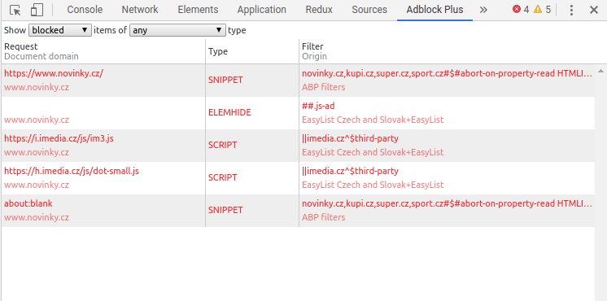
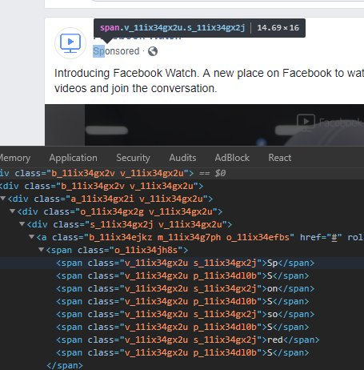

Buď jste na straně uživatele, který si pomocí AdBlock odstraní všechny reklamy aby mohl nerušeně brouzdat po internetových stránkách, nebo provozujete internetové stránky a AdBlock Vám blokuje reklamy, které monetizují Vaši práci. Cílem tohoto článku je pomoct Vám, jako provozovateli internetových stránek s bojem proti blokování reklamy. Abyste dokázali vyhrát, je potřeba pochopit jak AdBlcok funguje. Zjistit jeho silné a slabé stránky a nastavit odpovídajícím způsobem strategii proti blokování reklamy.

---

## Co je to AdBlock?

Jako AdBlock jsou primárně označovány doplňky webových prohlížečů, které blokují reklamy na webových stránkách. Uživatel si je jednoduše nainstaluje do webového prohlížeče a při brouzdání internetem se už nemusí o nic starat. Vše vyřeší AdBlock na pozadí.

### Druhy AdBlocků

Jsou různé druhy a variace AdBlock, které ve výsledků řeší stejný úkol. Mezi nejpoužívanější patří uBlock Origin, AdBlock a Adblock Plus. Pro tento článek se zaměříme na posledně zmíněný. Přesné statistiky nejsou, ale odhaduje se, že AdBlock používají vyšší jednotky až nižší desítky procent uživatelů na internetu. To už není zanedbatelné množství uživatelů a potencionálního příjmu z reklamy.

### Co a jak se blokuje?

Jak tedy AdBlock dokáže najít reklamu a prostě jí nezobrazit? K nalezení odpovědi je mít alespoň základní znalosti HTML a CSS. Mějme následující HTML strukturu:

```html
<div id="article">Toto je článek na webu.</div>
<div id="advertisement">Kupte si nový telefon se slevou 50%!</div>
<div id="article_2">Toto je další článek na webu.</div>
```

Při letmém pohledu je jasné co reklama je, a co reklama není. Doplňek AdBlock se jen podívá do své databáze známých reklam a porovná jednotlivé prvky na stránce. Pokud najde shodu, odstraní prvek ze stránky. Jelikož `id="advertisement"` je s největší pravděpodobností v databázi známých reklam, AdBlock odstraní tento prvek a všechny jeho potomky v HTML.

Termín odstranit není přesný, přesněji by se dalo říct, že ho schová. Takový reklamní prvek v HTML stále je, jen je mu pomocí CSS nastaveno pravidlo, které ho uživateli schová:

```css
display: none !important;
```

#### Jakou má AdBlock databázi známých reklam?

Zmíněná databáze známých reklam se nazývá easylist. Easylist může mít každý AdBlock doplněk vlastní. Easylisty se dále také můžou dělit i podle jazyku. Obsah easylistu je struktorován jako list jednotlivých pravidel, které mají dvě položky, a to doména a pravidlo.

To znamená, že každé pravidle je přiřazeno doméně. Tím je umožněno psát pravidla buď pro určitou doménu, či globálně pro všechny stránky.
Pro představu přikládám odkaz na [český easylist](https://github.com/tomasko126/easylistczechandslovak/blob/master/filters.txt) od uživatele tomasko126 na Githubu.

### Na co AdBlock cílí?

AdBlock může psát pravidla na cokoli v HTML a CSS. Může se zaměřit na úroveň zanoření HTML tagů, na jejich třídy, id, data atributy, css pravidla a jejich pořadí.

### Jak zjistit na co se chytá na mé stránce?

Pokud nevíte na co se AdBlock chytá na Vaší stránce, přikládám jednoduchý návod.

1. Nainstalujte si Adblock Plus jako doplněk do prohlížeče,
2. otevřete si DevTools (klávesová zkratka F12),
3. v DevTools si překlikněte na tab "Adblock Plus",
4. nahoře v dropdown si nastavte "Show _Blocked_ items of _any_ type",
5. Reloadněte stránku

Vypíše se Vám červeně list všech zablokovaných prvcích na stránce, jejich typy (script, element, apod.), domény a blokující pravidla. Dokážete z toho vyčíst i z jakého easlistu pravidlo pochází.



---

## Jak obejít AdBlock pravidla?

### Program pro _"přijatelné reklamy"_

První cesta je oficiální. Adblock Plus má [program](https://adblockplus.org/en/acceptable-ads) pro _"přijatelné reklamy"_, který uděluje vyjímku s blokováním reklamy za určitých podmínek.

Mezi podmínky patří:

- Umístění reklamy mimo hlavní obsah
- Jasné rozlišení co je obsah a co je reklama
- Velikost reklamy na stránce

### Vytvoření issue v easylistu pro odstranění pravidla

Pokud si myslíte, že AdBlock blokuje prvek, který není reklama, nebo pravidlo na Vaší stránce rozbijí layout, můžete do patřičného easylistu přidat issue s komentářem co se blokuje, co to rozbijí a jak to reprodukovat. V případě, že správce easylistu schválí Vaši reklamaci, bude pravidlo odstraněno či nahrazeno.

TIP: Tato strategie se dá použít i trochu jinak. To tak, že úmyslně uspořádáte prvky na stránce tak, že když AdBlock zablokuje prvek, layout stránke se rozpadne. Není ale garantované že uspějete s reklamací takového pravidla.

### Proxování URL ze zdrojů

Proxování známé reklamní URL přes Vaši doménu. AdBlock se může v HTML zaměřit na URL v odkazu (například `reklama.eshop.cz/mobil`) a tím celý reklamní prvek zablokovat. Když tedy URL v odkazu změníte například na `vasedomena.cz/redirect?id=3958104` a na straně serveru redirectnete z této URL na `reklama.eshop.cz/mobil`, AdBlock se nemá čeho chytit.

Takto se dají řešit i reklamní scripty, které AdBlock jednoduše zablokuje.

### Hashování CSS tříd a atributů

Často používaná technika boje proti AdBlock je hashování CSS tříd a dalších prvků. Pokud má reklama CSS třídu `Ad`, tak je prosté jí vyfiltrovat. Pokud hodnotu zahashujete, zafiltrovat jí bude naročnější. Pokud hodnotu dynamicky zahashujete, zafiltrování pomocí CSS tříd bude prakticky nemožné.

Takové dynamické zahashování může mít různé implemntace. Můžete k tomu například použít bundler (např. [Webpack](https://webpack.js.org/) společně s [CSS Modules](https://webpack.js.org/loaders/css-loader/#modules)) který třídy pomocí hashovací funkce zahashuje jako například _název třídy_ + _git commit hash_.

V tomto případě by se změnily CSS třídy při každém nasazení aplikace. Dále lze hash CSS tříd počítat i z aktuálního datumu (dne, týdne, měsíce). To Vám dá vysokou dynamiku názvu tříd, ale za cenu ztráty cachování.

### Maskování reklamy

Další problém reklamy jako takové je její unikátnost a jednoduché filtrování. Jak tedy maskovat takovou reklamu?

Přidat na stránku další nereklamní prvky, které mají stejnou HTML strukturu, ale jiný obsah. Takový prvek je náročnější nezahrnout do filtrovacího pravidla.

V případě, že AdBlock přidá pravidlo, které blokuje jak reklamu, tak i nereklamní prvek, můžete se vráti o pár kroků výše a vytvořit issue v příslušném easylistu.

### Použití SVG místo textu Reklama

Může se stát, že jste povinni označit reklamní prvek slovy "Reklama" či "Sponzorováno". To bohužel nahrává AdBlocku.

Obejít se to dá jednoduše. Místo textu jako takového zobrazíte SVG, které obsahuje daný text a vložíte ho jako obrázek na pozadí. Text v takto vloženém SVG je pro AdBlock skryt. Když tento přístup spojíte s hashováním URL daného SVG, máte solidní obranu.

```xml
<svg width="100" height="35" xmlns="http://www.w3.org/2000/svg">
  <g>
    <rect fill="none" height="37" width="102" y="-1" x="-1"/>
  </g>
  <g>
    <text font-family="Helvetica, Arial, sans-serif" font-size="24" y="24.5" x="2.5" stroke-width="0" stroke="#000" fill="#444">
      Reklama
    </text>
  </g>
</svg>
```

Abyste splnili i předchozí bod _Maskování reklamy_, můžete vytvořit druhé SVG, které nebude mít žádný text a bude mít nulovou velikost. Takové SVG vložíte všem nereklamním prvkům aby se opět od reklamy, co se týče HTML struktury, nejméně lišily.

Další přístup je rozparsování textů do několika HTML tagů v různém pořadí. Tento přístup například implementoval i Facebook.


### Převod uživatelů na mobilni verzi či nativní aplikaci

Trochu alternativní řešení je snaha mít více uživatelů na mobilním prohlížeči či na nativní aplikaci. Na těchto platformách není jednoduché reklamy blokovat. Například na mobilních verzí prohlížečů doplňky nejsou a jediná možnost pro uživatele je, si stáhnout prohlížeč, který má přímo integrovaný AdBlock.

---

## Závěr

Boj proti AdBlocku je běh na dlouhou trať, která se může vyplatit. Začněte s výpočtem kolik měsíčně kvůli AdBlocku ztratíte peněz. Můžete si spočítat kolik Vás bude přibližně časově stát prevence proti AdBlocku. Rozdíl mezi výpočty Vás může nebo nemusí přesvědčit o tom, zda se blokování reklamy bránit.
