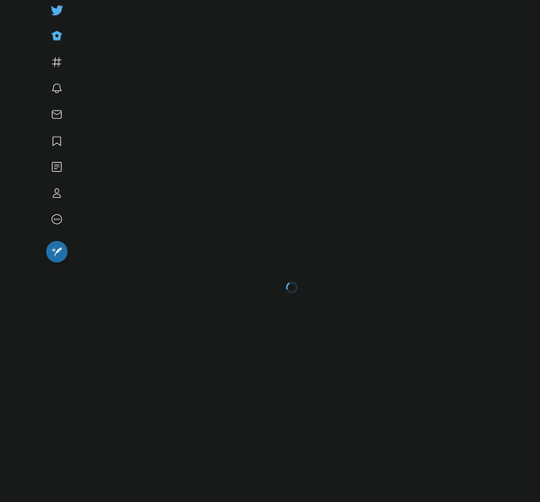
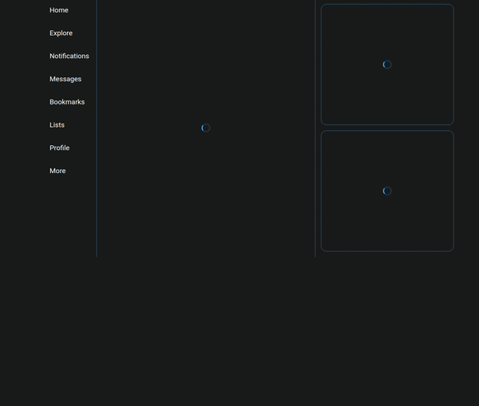

Toto je první část článku o Concurrent mode v ReactJS. Tato část se zabývá vysvětlením principu Concurrent Mode v ReactJS a jeho praktickou ukázku se `Suspense` API. Druhá část se zabývá části API, která pracuje s načítáním komponent, při interkaci uživatele.

Na konferenci React Conf 2019 tým zodpovědný za knihovnu ReactJS prezentoval experimentální release takzvaného Concurrent Mode. Přibližně dva týdny poté [zvěřejnil](https://reactjs.org/blog/2019/11/06/building-great-user-experiences-with-concurrent-mode-and-suspense.html) detaily na svém blogu. O co se jedná? Jedná se o nové API a praktiky, které mají jeden hlavní cíl, a to zlepšení uživatelské zkušenosti v React aplikacích. Ale jak?
Nové API by mohlo zrychlit renderování komponent o 30%. Nebo by se mohlo stahovat méně JavaScriptu. To by přece zlepšilo uživatelskou zkušenost, ne? Ne nezbytně nutně. Naopak v některých případech Concurrent Mode dokonce zobrazí informaci později než bez tohoto módu. Jak tedy může případné zpomalení načtení informace zlepšit uživatelskou zkušenost? Uživatelé nemají v ruce stopky aby si všimli, že se jim stránka vykreslila o 200ms rychleji, nebo že se konkretní komponenta vykreslila o 50ms rychleji. Samozřejmě není optimální když čekají 5 sekund na stránku. To ale není problém Reactu, ale architektur samotných aplikací. Uživatelé totiž používají oči pro posouzení rychlosti stránky. Nevídí tedy čas načtení stránky v milisekundách, ale způsob jejího načtení. Všimnou si kolik loading stavů se na stránce objevilo. Všimnou si kolikrát se změnil layout. Kde jaký boxík poskočil protože se do něj načetly informace. Optimalizací těchto vizuálních aspektů se docílí zmíněného zlepšení uživatelské zkušenosti.
Tyto vizuální aspekty nemusí být tolik patrné na nejnovějším Macbooku na 4G síti. Čím horší má uživatel hardware a internetové připojení, tím klesá kvalita uživatelské zkušenosti. Jelikož se počty uživatelů na mobilních zařízení stálé zvyšují, je vyšší pravděpodobnost, že uživatelská zkušenost není optimální.

## Řešení vázané na CPU

První část, kterou se ReactJS snaží optimalizovat je vytváření DOM nodu a práci s komponentama. Aktuálně ReactJS vykresluje komponenty způsobem, který blokuje jejich přerušení. To se v concurrent mode mění. Pokud se komponenta začne vykreslovat, lze ji přerušit a začít aktualizovat něco jiného, co má vyšší prioritu. Po té se opět vrátí k přerušenému vykreslení a dokončí vykreslení. Concurrent mode tímto snižuje potřebu použítí techniky debounce, která sice funguje jako optimalizační řešení, ale z uživatelského hlediska není optimální.

## Řešení vázané na donačítání informací

Druhá část Concurrent mode se zaměřuje na jakékoliv donačítání informací. Může se jednat o data z API, obrázky, skripty apod. Zjednodušeně React začne renderovat v paměti před tím, než samotná data ze sítě dorazí. Namítnou se dá situace, ve které potřebujeme reagovat na změnu v props, či je request závislý na props. V principu by volání requestů mělo být závislé na event handlerech. Přeloženo do řeči React bychom měli zavolat request v parent komponentře v event handleru. Tím docílíme, že renderování sub-komponenty a API request se začnou provádět paralelně.

```jsx
const App = () => {
  const [data, setData] = useState(props.defeaultData);
  const handleOnClick = useCallback(() => {
    setData(fetch(url + data.id).then(..));
  }, [props.defaultData]);
  return (
    <>
      <button onClick={handleOnClick}>
        Load data
      </button>
      <Site resource={data} />
    </>
  );
}
```

Pro zlepšení uživatelské zkušenosti jsou přidána nová API, která mají za cíl nastavit pořadí načítání jednotlivých komponent a způsob jejich načtení.

## Zapnutí Concurrent mode

Pro zapnutí Concurrent mode v aplikaci se mění API při inicializaci Reactu na DOM element. Pomocí API `createRoot` lze jednoduše zapnout Concurrent mode. Jelikož Concurrent mode má sémantické změny, byl přidáno i API `createBlockingRoot`, které slouží jako mezikrok při převodu komplexní aplikace na Concurrent mode.
V nových aplikacích lze tedy použít

```js
ReactDOM.createRoot(rootNode).render(<App />);
```

místo

```js
ReactDOM.render(<App />, rootNode);
```

## Suspense API

### Suspense

Jako první API, které použijete pro optimalizaci načítání dat je `Suspense`. Suspense počká s vykreslením komponenty na získání dat. Mezitím zobrazí fallback. Fallback může být cokoliv renderovatelného, tj. string, number či komponenta. Fallback se posílá jako prop `fallback` u `Suspense`.

```jsx
<Suspense fallback="Loading..">
  <Content />
</Suspense>
```

### SuspenseList

`SuspenseList` je obalovací komponenta, která funguje jako řídící centrum. Řídí tedy jaké Suspense sub-komponenty se vykreslí v jakém pořadí. Bez použití `SuspenseList` se jednotlivé `Suspense` renderují nezávisle na ostatních a na jejich pořadí v JSX.
SuspenseList má dvě props. První je `revealOrder`, který určuje v jakém pořadí se `Suspense` vykreslí. Může vykreslit popořadě (forwards), od konce (backwards) či všechny najednou (together). Druhý je `tail`, kterým řekneme, jak se mají zobrazovat fallbacky v jednotlivých `Suspense`. Defaultně `SuspenseList` zobrazí všechny fallbacky. S `tail="collapsed"` zobrazí pouze další fallback v pořadí. S `tail="hidden"` nezobrazí žádný fallback. SuspenseList pracuje pouze s jedním zanořením `Suspense`, ale není problém použít zanořené `SuspenseList` v sobě.

```jsx
<SuspenseList revealOrder="forwards">
  <Suspense fallback="loading">
    <Content />
  </Suspense>
  <Suspense fallback="loading">
    <SideBar />
  </Suspense>
</SuspenseList>
```

## Demo pro Suspense

Pro demo na Suspense API jsem si vybral Twitter. Při načtení prohlížečové verze se postupně vykresují loading stavy a načtený obsah. Netuším jestli s tím Twitter chce něčeho docílit či mi něco uniká, ale mně osobně to nevyhovuje. Rád bych tedy vytvořil aplikaci podobnou (strukturou) Twitteru. Jelikož Twitter nepovoluje dotazy na jejich API přímo z front-endu, vybral jsem si [newsapi.org](newsapi.org) jako zdroj dat. Pokud chcete zkusit demo, získejte si na jejich stránkách API klíč zdarma. Aplikace je vytvořena pomocí [create-react-app](https://github.com/facebook/create-react-app).



V animaci vidíte postupné načítání jednotlivých částí a jejich poskočení na Twitteru.
Nyní se podívejte, jak se načte demo aplikace se Suspense.



Vidíme, že se obsah zobrazí najednou poté, co se veškerá data načtou. Z uživatelského hlediska je to přívětivější.
Jak toho docílit? Vytvořil jsem si 4 bloky. První je aplikace jako taková, která je zodpovědná uspořádání jednotlivých subkomponent. Aplikace již obsahuje statický levý sloupec.
Poté byli přidány 3 komponenty:

- Feed
- TrendsForYou
- WhoToFollow

Tyto komponenty kopírují obsah na Twitteru. Každá z těchto tří komponent fetchuje data z API. Každý fetch je obalený `wrapPromise`, který začne stahovat data před prvním vykreslením.

```js
// wrapPromise.js
export function wrapPromise(promise) {
  let status = "pending";
  let result;
  let suspender = promise()
    .then((response) => {
      status = "success";
      result = response;
    })
    .catch((error) => {
      status = "error";
      result = error;
    });

  return {
    read() {
      if (status === "pending") {
        throw suspender;
      } else if (status === "error") {
        throw result;
      } else if (status === "success") {
        return result;
      }
    },
  };
}
```

Tento wrapper zavoláme nad komponentou a poté v komponentě voláme metodu `read`.

```jsx
// Feed.jsx
const fetchFeed = async () => {
    return await fetchWithKey(...).then(r => r.json());
}

const resource = wrapPromise(fetchFeed); // voláme fetch ve wrapPromise

const Feed = () => {
    const feed = resource.read(); // čteme resource
    return (
        <div className="Feed">
	        ...
        </div>
    );
};
```

Nyní máme komponentu `Feed` připravenou na Concurrent mode a stačí jen přidat `Suspense` kvůli chování při načítání. V `App` pomocí lazy-loading importujeme `Feed`. Jelikož feed Twitteru zajisté není jedna jednoduchá komponenta, přidáme `delay` pro simulaci většího JS bundlu a tím pádem delšího načtení.

```js
// App.js
const Feed = React.lazy(() => import("./components/Feed").then(delay(2500)));
```

Nyní můžeme přidat `Feed` spolu se `Suspense` do aplikace.

```jsx
const App = () => {
  return (
    <Suspense fallback={<Loader />}>
      <Feed />
    </Suspense>
  );
};
```

První komponentu máme hotovu. Nyní je potřeba přidat stejným způsobem i `TrendsForYou` a `WhoToFollow`. Přidáme taky základní strukturu HTML a CSS.

```jsx
// App.jsx return
<>
  <div className="Column Column--middle">
    <Suspense fallback={<Loader />}>
      <Feed />
    </Suspense>
  </div>
  <div className="Column Column--right">
    <Suspense
      fallback={<Loader className="TrendsForYou TrendsForYou--loading" />}
    >
      <TrendsForYou />
    </Suspense>
    <Suspense
      fallback={<Loader className="WhoToFollow WhoToFollow--loading" />}
    >
      <WhoToFollow />
    </Suspense>
  </div>
</>
```

Když zkusíme takový kód spustit pomocí `yarn start` nebo `npm start`, uvidíme přibližně stejné chování jako má stávající Twitter. Jednotlivé komponenty, závisle na délce `delay` a času při fetchi, se načtou v "náhodném" pořadí. Abychom toto pořadí usměrnili, přidáme místo React Fragmentu právě `SuspenseList` s props `revealOrder`. Výsledné JSX v `App` bude vypadat následovně.

```jsx
// App.jsx return
<SuspenseList revealOrder="together">
  <div className="Column Column--middle">
    <Suspense fallback={<Loader />}>
      <Feed />
    </Suspense>
  </div>
  <div className="Column Column--right">
    <Suspense
      fallback={<Loader className="TrendsForYou TrendsForYou--loading" />}
    >
      <TrendsForYou />
    </Suspense>
    <Suspense
      fallback={<Loader className="WhoToFollow WhoToFollow--loading" />}
    >
      <WhoToFollow />
    </Suspense>
  </div>
</SuspenseList>
```

Nyní by se měly všechny komponenty načíst ve stejnou chvíli. Je možné, že například `TrendsForYou` se načte dříve, ale počká na ostatní `Suspense` a až poté se zobrazí. Takto jednoduše se dá pracovat se `Suspense` v ReactJS. V [repozitáři](https://github.com/michalhonc/Twitter-with-suspense) jsem přidal i několik dalších variant načtení. V produkci si dokáži představit, že nejvyšší prioritu načtení bude mít `Feed` jakožto nejdůležitější prvek na Twitteru.

Celá aplikace je v repozitáři na [Githubu](https://github.com/michalhonc/Twitter-with-suspense).

## Shrnutí

První část článku o React Suspense se věnovala vysvětlení principu Concurrent Mode a aplikaci `Suspense` API v praxi. V další částí se podíváme na API `useTransition` and `useDeferredValue`, které pracují s loading stavy při uživatelské interakci. Ukážeme si, jak se dané API dá aplikovat v reálné aplikaci.
