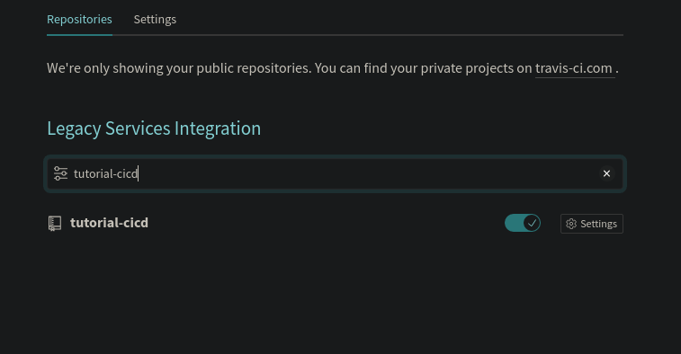
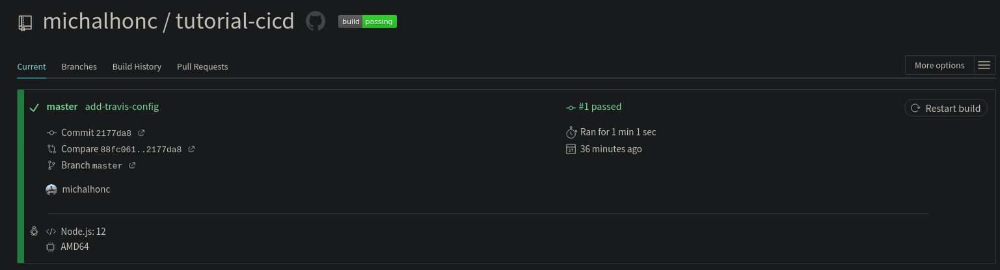
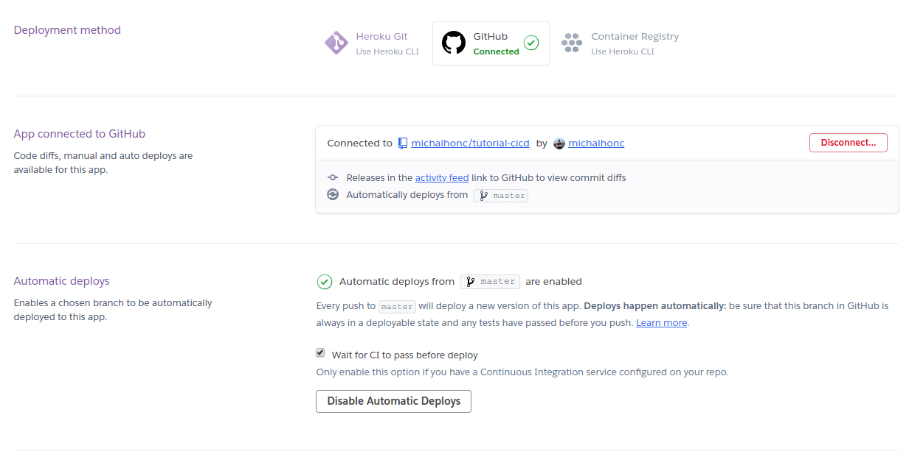

V tomto tutorialu vám ukáži, jak nastavit profesionální vývojové prostřední s pomocí continuous deployment.

Budeme používat React s pomocí předpřipraveného projektu [Create-react-app](https://create-react-app.dev/), ale můžete tento postup aplikovat na jakýkoliv projekt spravovaný pomocí NPM. I když nepoužíváte NPM, můžete použít jiné scripty pro testy a build. Pro tento tutoriál nemůsíte umět React ani JavaScript. React jsem vybral protože poskytuje rychlý projekt s předpřipravenými testy.

Před tím než začneme, potřebuje mít nainstalovaný:

- [NodeJS](https://nodejs.org/en/download/) s NPM s [Git](https://git-scm.com/),

- Musíte mít účet na [Github](https://github.com), Travis [Travis-ci.org](https://travis-ci.org/) a [Heroku](https://www.heroku.com/). Všechny účty jsou zdarma. Travis CI používá .org TLD pro git repozitáře, které jsou veřejně dostupné. .com TLD je pro privátní repozitáře. Pro tento tutoriál použijeme verzi s .org TLD

## Vytvoření projektu v Reactu s Create-React-App

Otevřete terminál ve své pracovní složce. Na mém počítači to je `~/sandbox/`

```shell
cd ~/sandbox/
```

V tomto adresáři vytvoříme projekt v Reactu s pomocí NPX (nástroj z NPM), které je předinstalováno v NPM ve verzi 5.2 a výše.

```shell
npx create-react-app tutorial-cicd
```

Spustí se instalace předpřipraveného projektu. Až se vše nainstaluje, na konci logu uvidíte všechny příkazy, které je možné v aplikaci použít. My si zatím otevřeme nový adresář.

```shell
cd tutorial-cicd
```

Nemusíme spouštět `npm install` jelikož `npx` už závislosti nainstaloval. Nyní můžeme aplikaci spustit

```shell
npm start
```

Nová záložka v prohlížeči se otevře na adrese `http://localhost:3000` a následující stránka se zobrazí


Dobrá zpráva je ta, že create-react-app již obsahuje sadu testů. Nemusíme tedy psát další. Pro zkoušku můžete spustit sadu testů pomocí

```shell
npm test
```

Budete vyzváni k spuštění testů s různými nastaveními. Nyní stačí zmáčknout tlačítko `a` abychom spustili všechny testy. Pouze jeden test by měl proběhnout. Test má název `renders learn react link`. Ten má za cíl zjistit, jestli se na stránce vykreslí odkaz, který můžete vidět na `http://localhost:3000`. Jelikož React odkaz vykreslí, test projde.

Nyní máme připravený projekt.

## Vytvoření Github repozitáře a jeho propojení s naším projektem

Pokud již máte vytvořen účet na Githubu, můžete pokračovat v tutorialu. Pokud ne, registrujte se prosím na [Github.com](https://github.com). Po přihlášení, vytvoříme nový repozitář. Nový repozitář lze vytvořit na adrese [https://github.com/new](https://github.com/new).

Repozitář nazveme `tutorial-cicd` a nastavíme ho jako `Public` (Veřejný). Nyní máme vytvořený repozitář, ale je potřeba ho propojit s naším projektem. To uděláme pomocí následujících příkazů ve složce projektu.

```shell
git remote add origin git@github.com:<vas_github_username>/tutorial-cicd.git
git push -u origin master
```

Poznámka: Vyměnte prosím `<vas_github_username>` v prvním příkazu za Váš username na Githubu. Tímto způsobem se připojujete k repozitáři pomocí SSH. Alternativou je propojení přes HTTPS

Nemusíme prováděd příkazy jako `git init`, protože to NPX udělal již za nás. Také přidal soubor `.gitignore`.

Jestli jste všechno udělali dle návodu, měli byste nyní vidět na Githubu pod tímto názvem Váš projekt.

Nyní máme propojený Github a náš projekt.

## Propojeni Github repozitáře s Travis CI

Nyní přichází část, kde propojíme náš repozitář s Travis CI. Měli byste být přihlášení v Travis CI pod svým Github účtem, na kterém existuje projekt `tutorial-cicd`.

Po úspěšném přihlášení klikněte na logo profilu v pravé horní části dashboardu. Klikněte na tlačítko `Nastavit` a potom na zelené tlačítko `Activate`. Poté byste měli vidět seznam veřejných repozitářů na vašem účtu Github. Pokud nevidíte repozitář `tutorial-cicd`, klikněte v levé části obrazovky na položku `Sync account`. K synchronizaci Github a Travis CI bude potřeba několik minut (nevím, proč synchronizace zabere tolik času). Po úspěšné synchronizaci byste měli vidět `tutorial-cicd` repozitář.



## Vytvoření konfiguračního souboru pro Travis

Abychom mohli specifikovat, co se má na straně Travis spustit, musíme vytvořit soubor `.travis.yml` v root adresáři našeho projektu.

```shell
touch .travis.yml
```

V tomto souboru specifikujeme programovací jazyk, který bude použit, jeho verzi a skripty.

Protože budeme používat JavaScript na serveru, použijeme NodeJS ve verzi 12. Pro tento tutoriál spustíme pouze testy a produkční build create-react-app. Takže do .travis.yml přidáme

```yml
language: node_js

node_js:
  - "12"

script:
  - npm test
  - npm run build
```

Uložíme a pushneme do repozitáře na Githubu

```shell
git add .
git commit -m "add travis.yml config file"
git push
```

Když navšívíte `tutorial-cicd` v Travisu na URL

`https://travis-ci.org/github/<your-github-name>/tutorial-cicd`

Uvidíte buď probíhající build (žlutý), již dokončený (zelený) či ukončený s chybou (červený).



Pod tímto boxem s informacemi je log celého buildu. Jestli se vyskytne během buildu nějaká chyba, zde uvidíte chybovou hlášku.

Jestli vše proběhne jak má a build je zelený, tak jste práve spustili první automatizovaný build!

## Vytvoření projektu na Heroku

Abychom měli kde hostovat aplikaci, musíme si vytvořit projekt na Heroku, které umožňuje spouštět aplikace v cloudu. Pro vytvoření je potřeba účet na jejich [webových stránkách](https://heroku.com). Po přihlášení vytvoříme novou aplikaci na [této URL](https://dashboard.heroku.com/new-app). Pojmenujte aplikaci jako `<vase-jmeno>-tutorial-cicd` a vyplňte region blíže k Vaší aktuální poloze. Pro mě je to `Europe`. Jestli je název aplikace již zabraný, změnte jeho prefix, ale nezapomeňte ho změnit i později. Klikněte na "Create app".

### Nastavení metodu pro deployment jako Github

Pro propojení Heroku s Github repozitářem, v sekci "Deployment method", vyberte Github. Najděte Váš Github repozitář a připojte ho. V sekci "Automatic deploys" zaškrtněte "Wait for CI to pass before deploy" a poté klikněte na "Enable Automatic Deploys".



## Propojení Travis a Heroku

Propojení Travis a Heroku spočívá v upravení našeho `.travis.yml` souboru. Před úpravou musíme vytvořit api klíč. Pro vytvoření je nutné mít nainstalovaný [Heroku](https://devcenter.heroku.com/articles/heroku-cli) a [Travis](https://github.com/travis-ci/travis.rb#readme) CLI. Po instalaci se přihlašte přes terminál do Heroku pomocí

```shell
heroku login
```

To vás vyzve k vyplnění e-mailu a hesla pro Heroku.

Po úspěšném přihlášení spusťte

```shell
travis encrypt $(heroku auth:token) --add deploy.api_key
```

Potvrdíte detekovaný repozitář vypsáním `yes` do terminálu a potvrzením. Poté se vás CLI zeptá, zda chcete přepsat Travis configurační soubor s částí pro deploy. Potvrďte vepsáním `y`. Otevře si `.travis.yml` a vypíšeme providera deploye a název aplikace. Soubor by výsledně měl vypadat takto

```yml
language: node_js

node_js:
  - "12"

script:
  - npm test
  - npm run build

deploy:
  provider: heroku
  app: <your_heroku_app_name>
  api_key:
    secure: <your_secure_key>
```

Nyní můžeme pushnout změnu do repozitáře

```shell
git commit -m "add deploy section to travis.yml"
git push
```

## Spuštění statických souborů na Heroku

Jelikož vytvoříme produkční build create-react-app, musíme specifikovat jak se má projekt spustit. Pro tuto část využijeme balíček `serve` z NPM. Jsou zde lepší alternativy pro spuštění serveru, ale tento je nejvíce přímočarý pro tutorial. Musíte tedy nainstalovat další závislost do projektu

V terminálu spustíme

```shell
npm install --save serve
```

Poté změníme náš `start` skript v `package.json` aby používal práve nainstalovaný `serve` balíček.

Poznámka: změnte pouzte řádek `start` v objektu `scripts`. Vše ostatní nechte beze změny.

```json
{
    ...
    "scripts": {
        "start": "serve -s build",
        "build": "react-scripts build",
        "test": "react-scripts test",
        "eject": "react-scripts eject"
    }
    ...
}

```

Můžeme opět commitnou a pushnout změny

```shell
git commit -m "add serve package"
git push
```

Po bezchybném dokončení buildu v Travis bychom měli vidět naší aplikaci běžet na adrese

`https://<your_heroku_app_name>.herokuapp.com/`

## Závěr

Právě jste nastavili continuous deployment, který nasadí změny přímo do produkce bez nutného zásahu lidské ruky. Jenom chyba v testech či v buildu zapříčiní zastavení nasazení. Pamatujte, že byste měli vždy vytvořit novou Git větev při vytvoření nových feature aby Vám někdo mohl udělat Code review před nasazením do produkce.

Můj repozitář může být nalezen na [zde](https://github.com/michalhonc/tutorial-cicd).
