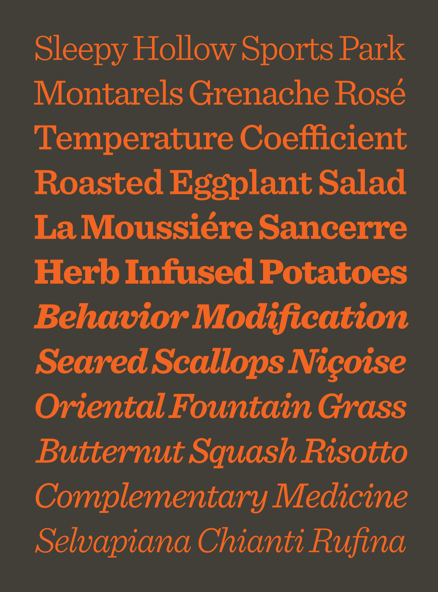
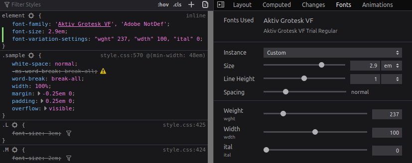

Variable Fonts je technologie, která nad jednotlivými znaky ve fontu dokáže provádět dynamické variace. Tyto variace se vytváří pomocí vektorů, které popisují směr a sílu dané variace. Jako analogii bych uvedl rozdíl mezi formáty PNG a SVG. Představte si, že máte obrázek s černým kolečkem ve dvou formátech, a to zmíněné PNG a SVG. Dostanete za úkol přidat na web obrázek se stejným kolečkem a stejnou velikostí, ale aby na mobilu bylo kolečko tenčí. S PNG nemáte jinou možnost, než nahrát druhý obrázek s nižší tučností znaku. Naopak s SVG nemusíte vytvářet nový obrázek a ten nahrát (ale můžete). Vy můžete ten SVG obrázek dynamicky změnit dle představ a upravit jeho `stroke-width`. Vytvoříte tedy variaci kolečka v SVG. Tato analogie je pouze rámcová, ale srozumitelně vysvětluje rozdíl mezi statickým a variable fontem.

## Jak je použít

Použití je dost podobné tomu se statickými fonty. Najdete si variable font (např. [zde](https://fonts.google.com/?vfonly); více odkazů najdete na konci článku), stáhnete si ho do projektu a odkážete na něj v CSS.

```css
@font-face {
  font-family: "MyVariableFont";
  src: url("../fonts/<your-variable-font>-VF.ttf");
}
```

Poté se na font odkážete v CSS selectorech.

```css
body {
  font-family: "MyVariableFont";
}
```

Pomocí CSS vlastnosti `font-variation-settings` již poté vytváříte variace Vašeho fontu. Tato vlastnost sdružuje editaci všech registrovaných i custom os. Označení osy se zapisuje do uvozovek a za ní se vloží její hodnota. Jednotlivé osy se oddělují čárkou. Mezi registrované osy, kterou jsou lowercase, patří následující list. Jednotlivé osy jsou doplněny jejich ekvivalentem v podobě CSS vlastnosti pro statický font.

- "wght" / font-weight
- "wdth" / font-stretch
- "slnt" / font-style (oblique, angle)
- "ital" / font-style (italic)
- "opsz" / font-optical-sizing

Každý font může mít specifikované vlastní osy, které se píší uppercase. Uppercase není povinné pro vlastní osy, ale je to best practice. Platí tedy, že osy jsou case-sensitive.
Jako příklad uvedu titulek, kterému nastavíme font-weight na `666` a lehký sklon 5 stupňů.

```css
h1 {
  font-variation-settings: "wght" 666, "slnt" 5;
}
```

## Využití

V jakých situacích se Vám variable font vyplatí?

### Optimalizace (někdy)

Jedna s nejčastěji probíraných výhod variable fontů je velikost souboru s fonty. Pokud použijete jeden custom font s jedním řezem, variable fonty se Vám nevyplatí jelikož statický font je většinou menší. Pokud využíváte vícero řezů jednoho fontu, už byste měli nad variable fontem začít přemýšlet. Další příležitost, kde ušetřit na velikosti, je verze italic. Pokud italic na webu nevyužíváte, je zbytečné jí mít obsaženou ve variable fontu.

### Máte dark mode

V dnešní době je populární mít dark mode verzi svého webu. Tím ale může pokulhávat čitelnost textu. Černý textu na bílém pozadí má více kontrastu oproti bílému textu na černém. To lze napravit drobným zvýšením `"wght"` (`font-weight`) v dark modu, které dodá potřebný kontrast. Tím by se dalo řešit i snížení jasu na adaptivních obrazovkách až bude dostupné API. Pokud je uživatel na přímém slunci a display se mu ztmaví, pomocí variable fonts zvýrazníme texty a naopak.

### Kreativní design

S pomocí variable fonts se dají vytvořit zajímavé animace, který upoutají pozornost.


Designérům variable fonts otevírají novou sféru nápadů, které se dají aplikovat.


## Fallback

Jako fallback pro starší prohlížeče lze použít CSS at-rule `@supports`

```css
@supports (font-variation-settings: "wdth" 900) {
  ...;
}
```

## Zajímavé zdroje a nástroje

### v-fonts.com

Nabízí přehledný zdroj variabilních fontů kde si můžete vyzkoušet jednotlivé variable fonty a pomocí sliderů vytvářet jejich variace.
[https://v-fonts.com/](https://v-fonts.com/)

### axis-praxis.com

Další knihovna variable fontů, které lze editovat přímo na stránce.
[https://www.axis-praxis.org/](https://www.axis-praxis.org/)

### play.typedetail.com

Interaktivní playground pro variable fonty. Tento nástroj je spíše pro návrháře.
[http://play.typedetail.com/](http://play.typedetail.com/)

### Firefox font inspector

Výborným nástrojem pro vývojáře a designéry jsou DevTools pro Firefox. Ty obsahují v tabu Inspector záložku `Fonts`, kde se dají pomocí GUI editovat vlastnosti fontů.


### docs.microsoft.com

Detailní specifikace od Microsoftu
[https://docs.microsoft.com/en-us/typography/opentype/spec/otvaroverview](https://docs.microsoft.com/en-us/typography/opentype/spec/otvaroverview)

### drafts.csswg.org

W3C CSS Fonts Module 4 specifikace
[https://drafts.csswg.org/css-fonts-4/#font-rend-desc](https://drafts.csswg.org/css-fonts-4/#font-rend-desc)

## Shrnutí

Variable fonty nejsou žádná novinka roku 2020. Tato technologie byla představena v roce 2016, implementována ve Photoshopu v roce 2017 a podpora pro web následovala v roce 2018. Nyní jí dle Can I Use dostupná pro ~90% uživatelů (celosvětově). Po dvou letech stále nejsou variable fonty tam, kde by být asi měly. Jeden z problémů je nedostatek free-to-use variable fontů a také fakt, že IE11 tuto technologii nepodporuje. Když pomineme tyto neduhy, vyjde nám technologie variable fonts jako nově odemknutá místnost plná kreativních nápadů a možností jak posunout vývoj webových aplikací.
