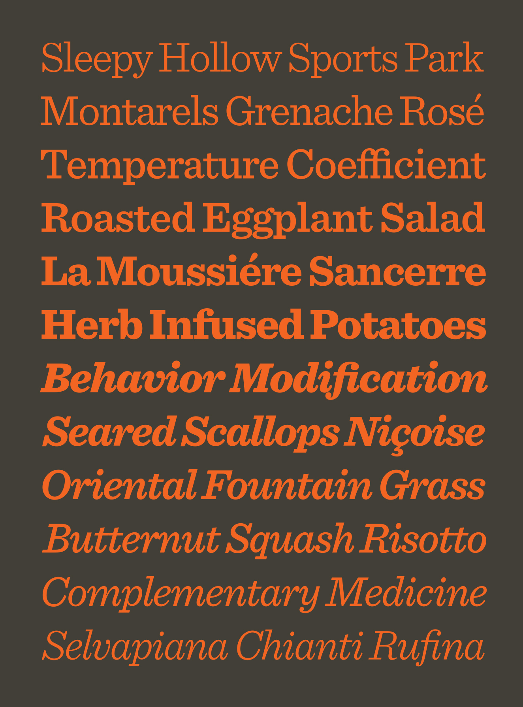
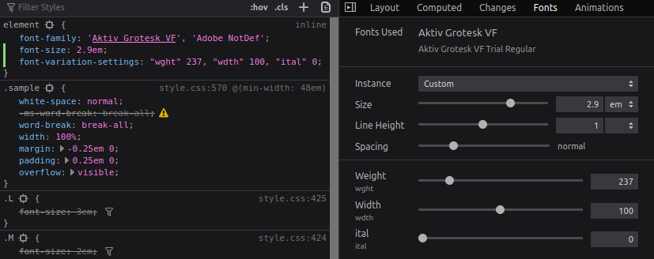

Variable Fonts is a technology that can perform dynamic variations over individual characters in a font. These variations are created using vectors that describe the direction and strength of the variation. As an analogy, I would mention the difference between PNG and SVG formats. Imagine having an image with black circle in two formats, namely PNG and SVG. You get the task of adding a picture to the web with the same circle and the same size, but to make the circle thinner on mobile. With PNG, you have no choice but to upload a second image with lower stroke width. Conversely, with SVG, you don't have to create a new picture and upload it (tho you can). You can dynamically change that SVG image by imagining and edit its `stroke-width`. So you create a variation of the circle in the SVG. This analogy is incomplete, but understandably explains the difference between a static and a variable font.

## How to use them

The usage is pretty similar to that of static fonts. You'll find a variable font (e.g. [here](https://fonts.google.com/?vfonly); you'll find more links at the end of the article), download it to the project and refer it to CSS.

```css
@font-face {
  font-family: "MyVariableFont";
  src: url("../fonts/<your-variable-font>-VF.ttf");
}
```

Then you simple refer to this font in CSS selectors.

```css
body {
  font-family: "MyVariableFont";
}
```

Using CSS property `font-variation-settings`, you are already creating variations of your font. This property brings together editing of all registered and custom axis. The axis marking is written in quotation marks and its value is placed behind it. Each axis is separated by a comma. The registered axis, which are lowercase, includes the following sheet. Each axis is complemented by their equivalent in the form of a CSS property for a static font.

- "wght" / font-weight
- "wdth" / font-stretch
- "slnt" / font-style (oblique, angle)
- "ital" / font-style (italic)
- "opsz" / font-optical-sizing

Each font may have specified custom axes written uppercase. Uppercase is not mandatory for its own axis, but it is best practice. It also means that the axis are case-sensitive.

As an example, I'll give you a caption that we set the font-weight to `666` and a slight drop of 5 degrees.

```css
h1 {
  font-variation-settings: "wght" 666, "slnt" 5;
}
```

## Benefits

In what scenarios will the variable font pay off?

### Optimization (it depends)

One with the most commonly discussed benefits of variable fonts is the size of the font file. If you use one custom font with one weight, variable fonts won't benefit you as the static font is mostly smaller. If you're using multiple weights of one font, you should start thinking about the variable font by now. Another opportunity to save on size is the italic version. If you are not using italic on the web, it is pointless to have it contained in the variable font.

### You have dark mode

Nowadays it's popular to have a dark mode version of your site. But this may sour the legibility of the text. Black text on a white background has more contrast than white text on black. This can be remedied by a small increase in the `"wght"` (`font-weight`) in dark mode, which will provide the necessary contrast. This could also address the reduction in brightness on adaptive screens when the API becomes available. If the user is in direct sunlight and the display gets dark, we use variable fonts to highlight the text and vice versa.

### Cretive designs

With the help of variable fonts, interesting animations can be created to attract attention.


The designers variable fonts open up a new realm of ideas that can be applied.


## Fallback

As a fallback for older browsers, CSS can be used at-rule `@supports`.

```css
@supports (font-variation-settings: "wdth" 900) {
  ...;
}
```

## Intriguing resources and tools

### v-fonts.com

It offers a clear source of variable fonts where you can try individual variable fonts and use sliders to create variations of them.
[https://v-fonts.com/](https://v-fonts.com/)

### axis-praxis.com

Another library of variable fonts that can be edited directly on the page.
[https://www.axis-praxis.org/](https://www.axis-praxis.org/)

### play.typedetail.com

Interactive playground for variable fonts. This tool is more for designers.
[http://play.typedetail.com/](http://play.typedetail.com/)

### Firefox font inspector

An excellent tool for developers and designers are DevTools for Firefox. These include a tab in the Inspector tab, 'Fonts', where you can use GUI to edit the properties of the fonts.


### docs.microsoft.com

Detailed specification from Microsoft
[https://docs.microsoft.com/en-us/typography/opentype/spec/otvaroverview](https://docs.microsoft.com/en-us/typography/opentype/spec/otvaroverview)

### drafts.csswg.org

W3C CSS Fonts Module 4 specification
[https://drafts.csswg.org/css-fonts-4/#font-rend-desc](https://drafts.csswg.org/css-fonts-4/#font-rend-desc)

## Summary

Variable fonts are nothing new in 2020. The technology was introduced in 2016, implemented in Photoshop in 2017 and support for the web followed in 2018. Now, according to Can I Use, it's available to 90% of users (worldwide). Two years on, variable fonts still aren't where they should be. One problem is the lack of free-to-use variable fonts, as well as the fact that IE11 does not support this technology. These ailments aside, variable fonts technology comes out as a newly unlocked room full of creative ideas and ways to shift the development of web applications.
