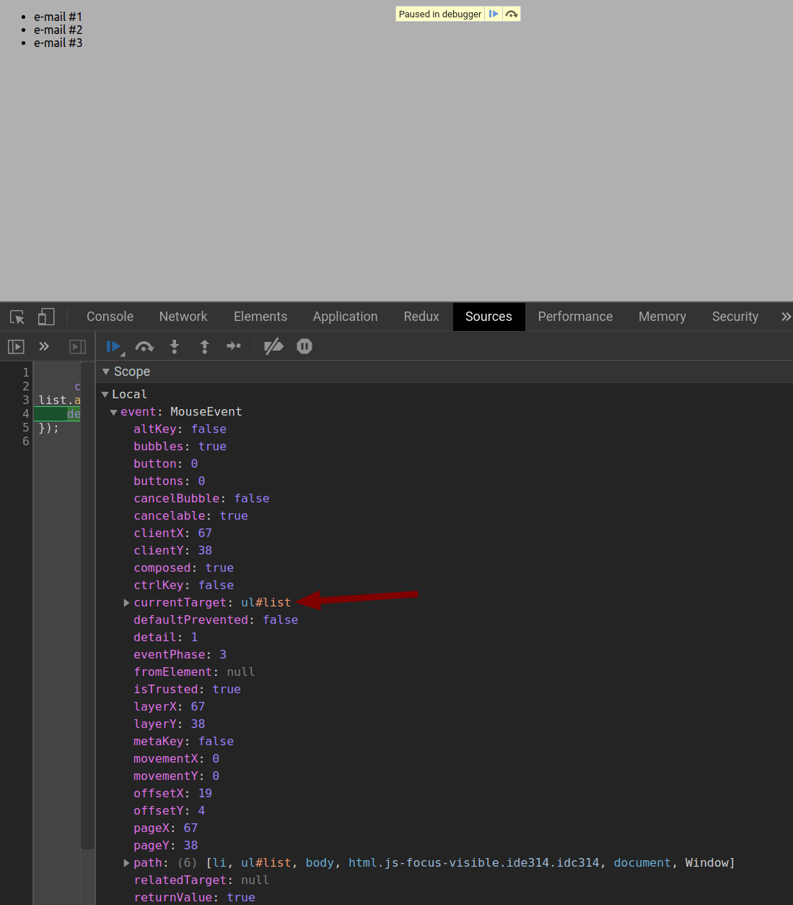
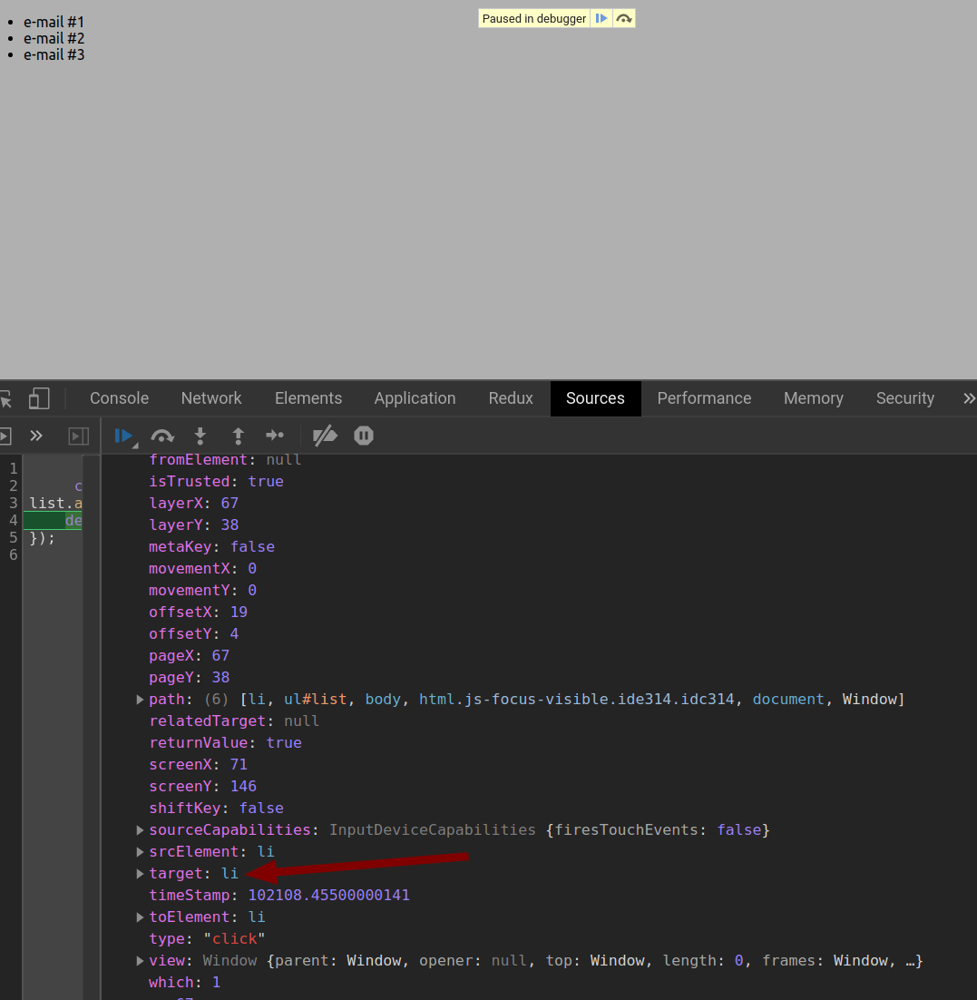

# Rozdíl mezi Event targets v JavaScriptu a jak je využít k optimalizaci.

Představte si aplikaci, která obsahuje 200 klikatelných prvků na stránce. Reálným příkladem může být list e-mailů v single-page aplikaci. Každý e-mail poslouchá na `click` event aby následně otevřel overlay s obsahem e-mailu. Nechcete často proklikávat na další stránky, tak si zaškrtnete možnost zobrazit 200 e-mailů na jedné stránce. Nyní máte na stránce minimálně 200 event listenerů, které se museli alokovat. Takové množství už dokáže způsobit problémy s výkonem stránky na starších strojích. Takový problém lze řešit vcelku jednoduše pomocí variant Event targets. Stejné řešení používá i populární JavaScriptová knihovna ReactJS pro optimalizaci aplikací. Jak tento problém řešit jako experti z Facebooku naleznete níže.

---

Každý kdo pracoval s Event handlery reagující na interakce uživatele se setkal s Event targets. Event target je objekt, který obsahuje informace o elementu, nad kterým event nastal. Definice je vcelku přímočará. Matoucí je fakt, že každý event má dva až tři Event targety z celkových tří možných.
Všechny eventy obsahují targety:

- event.target
- event.currentTarget

Eventy, ke kterým dochází v důsledku interakce uživatele s polohovacím zařízením (myš, touchpad) mají navíc tento target:

- event.relatedTarget

## event.relatedTarget

Začneme tím nejméně známým, ale nejjednodušším, a to `event.relatedTarget`. Tento objekt se používá v MouseEvent například při mouseenter, neboli při eventu, kdy kurzorem zajedeme do elementu (např. `id=red`), který na tento event poslouchá. Object relatedTarget po zavolání mouseenter obsahujeme okolní element, ze kterého jsme na našeho elementu (`red`) kurzorem zajeli.

Objekt relatedTarget tedy obsahuje sekundární cíl. Co relatedTarget obsahuje při jakém eventu lze dočíst v [dokumentaci](https://developer.mozilla.org/en-US/docs/Web/API/MouseEvent/relatedTarget).
Tím jsme probrali relatedTarget a nyní se můžeme podívat na zbylé dva (target, currentTarget), se kterými lze docílit v úvodu zmíněné optimalize.

## Event delegation

Abychom dokázali pochopit rozdíl mezi target a currentTarget, je třeba pochopit takzvaný Event delagation. Jedná se o techniku delegování poslechu eventů parent elementu pro všechny eventy, které se uskuteční uvnitř daného parent elementu. Co daný event provádí je takzvaný Event bubbling, kde každý event probublá přes všechny parent elementy až k `html` elementu. Jakýkoliv listener v jakémkoliv parentu může tento probublávající event zachytit.
Díky Event delegation můžeme na `html` elementu zachytit všechny události, které nastaly kdekoliv na stránce.

```js
// tuto funkcionalitu lze pro dany event ukoncit pomoci
event.stopPropagation();
```

## event.target vs event.currentTarget

Už víme jak eventy fungují. Jaký je tedy rozdíl mezi target a currentTarget? Target obsahuje referenci na objekt, nad kterým byl event zavolán, kdežto currentTarget je read-only objekt elementu, na který byl event listener napojen. Lépe to lze vysvětlit na příkladu. Jako příklad použijeme list s e-maily z úvodu. Vytvoříme tedy list s položkami v HTML

```html
<ul id="list">
  <li>e-mail #1</li>
  <li>e-mail #2</li>
  <li>e-mail #3</li>
</ul>
```

V JavaScriptu přidáme event listener, který bude poslouchat `click` eventy na `<ul>` elementu.

```js
const list = document.getElementById("list");
list.addEventListener("click", (event) => {
  debugger;
});
```

V případě, že se vyvolá event `click`, vyvolá se debuggovací funkcionalita (pokud v prostředí existuje). Když kód spustíme v prohlížeči, bude se chovat jako breakpoint (zastaví se exekuce kódu). Po naražení na náš breakpoint můžeme prozkoumat obsah proměných.
Otevřeme si tedy vytvořený kód v prohlížeči a zároveň otevřeme DevTools (F12). Uvidíme list a v něm tři položky (e-mail #1-3). Když klikneme na první položku, zasekneme se na breakpointu a můžeme v pozastavené stránce prozkoumat proměnné. V tomto případě nás zajímá hodnota parametru `event` v arrow funkci uvnitř `addEventListener`. Na screenshotu níže vidíme, že currentTarget odkazuje na `<ul>` list. Když najedete kurzorem na `ul#list` tak se vám na stránce vyznačí na jaký element se odkazuje.

Po zascrollování vidíme i target, který odkazuje na položku na kterou jsme kliknuli.

Vidíme tedy, že target obsahuje element, na který se kliklo a currentTarget element, který na klik poslouchal. Bystré oko si všimne i relatedTargetu, jelikož je i `click` event MouseEvent.
Nyní už máme solidní porozumění ohledně rozdílu mezi target a currentTarget.
**Poznámka:** `debugger` v kódu používáme především protože currentTarget je dostupný pouze v době zpracování eventu. Pokud si tedy zavoláme `console.log(event)`, v daném objektu uvidíte v konzoli currentTarget jako `null`. Pozor na to!

## Optimalizace

Jak tedy tento rozdíl promítnou do optimalizace kódu? V případě, že bychom měli na stránce několik desítek/stovek/tisíc souvisejících elementů, který by měly vlastní event handlery, zbytečně bychom zahltili prohlížeč listenery. Dále bychom zahltili i nás. Pro každý element bychom museli přidat event listener a případně ho i odstranit. To se může vymknout kontrole. Jednoduší přístup je tedy nastavit jeden event listener na parent element (v našem případě `<ul>`), který bude pomocí target rozlišovat kliknutí na jednotlivé položky (e-maily v `<li>`).

Stejný přístup používá i zmíněný ReactJS. Ten nastaví jeden event listener na root element, který zachytává všechny události, které následně přiřadí jednotlivým listenerům jako [SyntheticEvent](https://reactjs.org/docs/events.html). SyntheticEvent je obal nativního eventu kvůli cross-browser kompatibilitě. Tímto delegováním ReactJS docílí značné optimalizace.
**Poznámka:** v aplikacích s ReactJS je tato optimalizace zbytečná, jelikož to již dělá ReactJS.

## Shrnutí

Vysvětlil jsem rozdíl mezi target, currentTarget a relatedTarget. Víme, že relatedTarget je pouze na MouseEvent eventech. Dále také rozdíl mezi target a currentTarget pomocí event delagation využívající event bubbling, který lze použít k optimalizaci.
